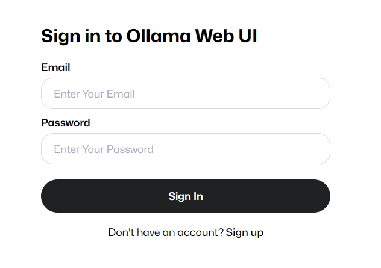
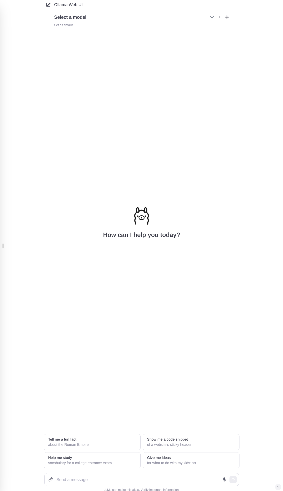
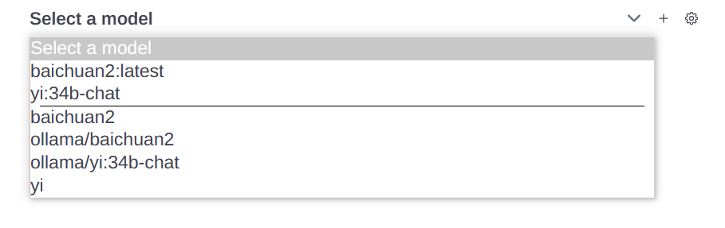

# 大模型简易使用手册

本次提供的大模型为Baichuan2-13b-chat-v1和Yi-34b-chat(4b量化)，受计算资源所限，仅支持同时运行一个Baichuan2实例和一个Yi实例，繁忙时按请求时间进行排队，空闲时的第一次请求会将模型加载进显存，等待时间会久一些。

## Webui使用

校园网环境下访问<http://59.78.189.138:8080>



点击Sign up进行注册，注册完成后需等待管理员进行确认，等待管理员给与权限后即可使用：

点击右上角选择模型，也可点击+号一次选择多个模型，建议选择横线下方的baichuan2和yi,其余的只是会指定运行模型的实例：

选择完模型后在对话框中输入你的问题即可开始对话。
注意这两个模型并不支持上传文件对话。

## api使用

### 命令行使用
linux环境下使用以下命令

```bash
curl --location 'http://59.78.189.138:8000/chat/completions' \
--header 'Content-Type: application/json' \
--data ' {
      "model": "baichuan2",
      "messages": [
        {
          "role": "user",
          "content": "你是谁"
        }
      ]
    }
'
```

修改"model"为你想要的模型，"content"为你想要的内容即可，由于这种方式无法流式传输，要等待回答全部生成完才会返回。

### python使用

首先安装依赖

```bash
pip install openai
```

安装完成后即可在python脚本中使用，请求的格式与openai一致，示例代码如下

```python
import openai 
client = openai.OpenAI(api_key="anything",base_url="http://59.78.189.138:8000") 
response = client.chat.completions.create(model="yi", messages = [
    {
        "role": "user",
        "content": "你是谁"
    }
])

print(response)
```

更改"model"与"content"即可
